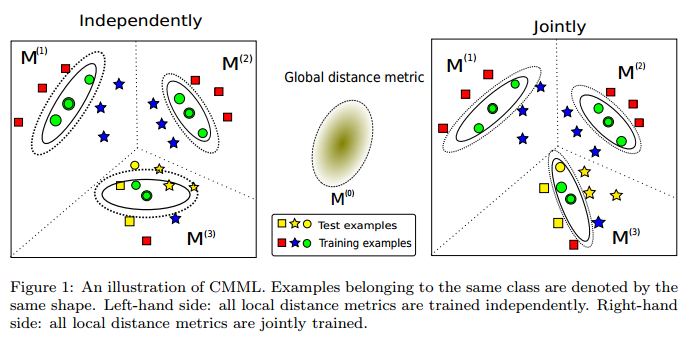

# CMML - Clustered Multi-Metric Learning
An efficient method for clustered multi-metric learning

CMML contains the implementation of Clustered Multi-Metric Learning. 
For any question, please contact Bac Nguyen (Bac.NguyenCong@ugent.be).

## Abstract
Distance metric learning, which aims at finding a distance metric that separates examples of one class from examples of the other classes,  is the key to the success of many machine learning tasks. Although there has been an increasing interest in this field, learning a global distance metric is insufficient to obtain satisfactory results when dealing with heterogeneously distributed data.  A simple solution to tackle this kind of data is based on kernel embedding methods. However, it quickly becomes computationally intractable as the number of examples increases. In this paper, we propose an efficient method that learns multiple local distance metrics instead of a single global one. More specifically, the training examples are divided into several disjoint clusters, in each of which a distance metric is trained to separate the data locally. Additionally, a global regularization is introduced to preserve some common properties of different clusters in the learned metric space. By learning multiple distance metrics jointly within a single unified optimization framework, our method consistently outperforms single distance metric learning methods, while being more efficient than other state-of-the-art multi-metric learning methods.



### Prerequisites
This has been tested using MATLAB 2010A and later on Windows and Linux (Mac should be fine).

### Installation
Download the folder "CMML" into the directory of your choice. Then within MATLAB go to file >> Set path... and add the directory containing "CMML" to the list (if it isn't already). That's it.

### USAGE

Please run (inside the matlab console)
```matlab
demo_1
demo_2
```

## Authors

* [Bac Nguyen Cong](https://github.com/bacnguyencong)

## Acknowledgments
If you find this code useful in your research, please consider citing:
``` bibtex
@Article{Nguyen2018,
  Title       = {An efficient method for clustered multi-metric learning},
  Author      = {Bac Nguyen and Francesc J. Ferri and Carlos Morell and De Baets, Bernard},
  Journal     = {Information Sciences},
  Year        = {2018},
  doi       = {10.1016/j.ins.2018.08.055},
}
```
